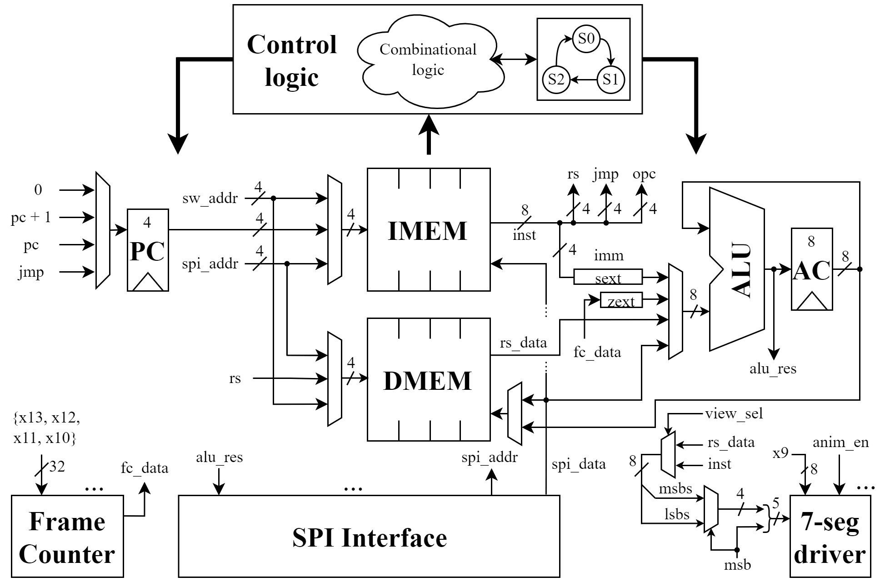
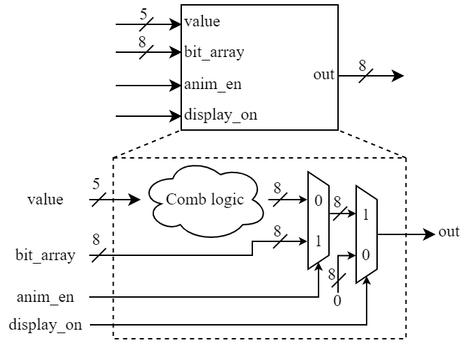

  

# Tiny Processor

The readme file is split into two sections; The introduction section that describes the software part, and the hardware part of this project, and a *hands on* section which shows how to simulate the design or implement it on an FPGA. In the software part of the first section we describe the ISA, the programming model and the compiler script that was used to generate the executable files. In the hardware part we describe the harware components of the *Tiny Processor* design.

## Software

### ISA

The below image shows the processor's ISA.

<p align=center>  </p>

The first column contains the alias of the instruction that is used in the assembly. The second column contains its action, and finally the third, its opcode. The opcode field is the lower 4 bits of an instruction. The other 4 bits may encode a register source id, a 4-bit signed immediate or a target branch address.

<p align=center>  </p>

The table below shows some examples, of the instructions' encoding.

| Instruction | Encoding | Action |
| :-----------: | :-----------: | :-----------: |
| addi -1 | 0xF8 | $acc \leftarrow acc + (-1)$ |
| la x3   | 0x33 | $acc \leftarrow x3$ |
| add x2  | 0x20 | $acc \leftarrow acc + x2$ |
| srl x10 | 0xA6 | $acc \leftarrow acc >> x10[2:0]$ |

### Programming model

#### Register File or Data memory

The processor contains in total 16 registers (Data memory capacity), withought taking into account the program counter and the accumulator registers. The first 15 registers are 8-bits wide while the last is a single bit wide register (a pseudo-register). The registers are divided into 5 groups;

- **GPRs ($x0-x8$)**: These are simple general purpose registers. They store and provide intermediate results or data while the programm is being executed. The GPR registers can be updated w/ the sa instruction (store accumulator).
- **Animation register ($x9$)**: This group contains a single register that can be used as a GPR register. It is also used to feed the 7-segment display when the animation switch is on.
- **Frame counter registers ($x10-x13$)**: These registers can also be used as GPR registers. Combined (LSR: $x10$) they form a 32-bit unsigned integer value that is used to initialize the frame counter's count, when it is reset.
- **SPI register ($x14$)**: This register is used as a buffer that stores the data that is about to be sent or received from the processor via the SPI interface. It is a read-only register.
- **FC sync register ($x15$)**: This is a single bit pseudo-register (it's value is a result of comparing a register with the value 1), that indicates the start of a new frame. This is also a read-only register.

<p align=center>  </p>

#### Accumulator register

Because the 8-bit width of an instruction allows only for a single 4-bit operand (provided that the opcode is 4-bits), we added an accumulator register.
The accumulator register is an extra 8-bit register used as source and destination register of any arithmetic instruction, as was shown in the ISA image above. An example sequence of instructions to add registers $x5$, $x11$, store the result to register $x0$, and then output the result to an external SPI device would be;

| Instruction | Action |
| :-----------: | :-----------: |
| la  x5 | $acc \leftarrow x5$ |
| add x11 | $acc \leftarrow acc + x11$ |
| sa  x0 | $x0  \leftarrow acc$ |
| spiw x0| $x0  \rightarrow spi\ write$ |

## Compiler

To ease the task of writing kernels for the processor, we developed a Python compiler script, located in the `compiler` directory. The script takes as input a `.tp` file, a format field `-f` (hex (default), bin, dec), and outputs an executable `.mem` file. Below we demonstrate step-by-step, how to create an executable that animates the seven segment display in a circular pattern.

### Go to the compiler directory
```
$ cd <path-to-git-dir>/compiler
```
### Create a .tp file

```
$ vi anim0.tp
```

File contents:

```
main:
  la x15
  bnez skip
    la x1
    and x9
    bnez to_init
      la x9
      slli 1
      j skip_rest
    to_init:
      li 1
    skip_rest:
      sa x9
  skip:
j main
```

#### Note
Identation doesn't matter. Each instruction and label must be on a separate line. Comments are not supported.

While the frame counter's count is not `0` the value of the animation register $x9$ stays the same. This is acheived by branching to the `skip` label @ the end of the loop's body. When the counter reaches `0` the inner body of the loop (start @ `la x1`) is executed. Here the value of the animation register is updated. To animate the 7-segment in a circular pattern a single bit shift is applied. If there is no more need to shift, we initialize the animation register back to the value `1`. Below is a diagram indicating how the change of the animation register's value, affects the output of the 7-segement display.

<p align=center>  </p>

### Save and compile

Manually:

```
$ python c.py anim0.tp -f hex
```

Using bash script:

```
$ ./c.sh
$ File name: anim0.tp
$ Format: hex
```

### Create a .mem file for RF (DMEM) initialization

```
$ vi anim0d.mem
```

File contents:

```
1
20
0
0
0
0
0
0
0
1
40
78
7D
01
0
0
```

#### Note
Only register $x0-x13$ can be initialized w/ the `.mem` file. The last 2 registers are read-only registers. The 32-bit value
`32'h017D7840` is the count of clock ticks between consecutive frames.

### Use of .mem files 

The `anim0.mem` file can be used to initialize the `imem` variable of the driver. Simply insert the file path of the generated `.mem` file in the corresponding **$readmemh** macro located in the driver.sv module.

```
logic[7:0] imem[16];
logic[7:0] dmem[16];

initial $readmemh("<path>/anim0.mem ", imem);
initial $readmemh("<path>/anim0d.mem", dmem);
```

The `anim0d.mem` file is an initialization file for the registers;
  - $x0 \leftarrow 8'h01$
  - $x1 \leftarrow 8'h20$
  - $x9 \leftarrow 8'h01$
  - $x10 \leftarrow 8'h40$
  - $x11 \leftarrow 8'h78$
  - $x12 \leftarrow 8'h7D$
  - $x13 \leftarrow 8'h01$
  - $other \leftarrow 8'h00$

During initialization of the processor, the driver copies the instructions from imem, and data from dmem, to the corresponding memories of the processor.

## Hardware

### IO

Below is a schematic that shows all the inputs and outputs the processor design has.

<p align=center>  </p>

#### Switches ( ui_in[7:0] )
- **SW[0]**: Switch the display on/off. When the switch is off the 7-segment display shows nothing. When it is on, the displayed contents are dependent on the SW[7:6] values.
- **SW[1]**: Choose which bits of a Byte to display. When this switch is on, Byte[7:4] is displayed, and when it's off, Byte[3:0] is displayed.
- **SW[5:2]**: These provide the register's address when SW[0] is on and the processor has finished execution (It is in its `IDLE` state). All registers that can be used as a GPR register can be displayed.
- **SW[6]**: When this switch is turned on, data from the instruction memory is displayed. When it's off, data from the register file is shown. 
- **SW[7]**: This enables the animation of the 7-segment display. When it is turned on, the 7-segment display is directly fed by the animation register $x9$.

#### Outputs ( uo_out[7:0] )

These are directly connected to each segment of the 7-segment display

#### Bidirectional IO ( uio_{in, out}[7:0] )
- **ctrl[1:0] (I)**: These are the control signals that the external driver uses to initialize the processor and signal it to begin execution. The initial value should always be `2'b00`, this means *do nothing*. The driver sends data to the processor in forms of a packet. A single packet carries 12-bits of data; The payload (8-bits) and its destination address (4-bits). When the driver wants to write the instruction memory of the processor he sets the control signal to `2'b10` and sends a single packet of data to the processor. When the transaction is complete, the driver stalls for a couple of cycles and procedes to send the next packet. Once all packets for the instruction memory have been sent, the driver switches the control signal to `2'b01` and follows the same procedure to initialize the register file of the processor. Once initialization is over the driver sets the signals to `2'b11` and the processor begins the execution of the program.
- **done (O)**: This signal is used to indicate that the processor is in its idle state (does nothing).
- **SPI IO (IO)**: The next 4 IOs belong to the SPI interface.
- **sync (O)**: This last BIO is used to output the value of the $x15$ register. 

### Datapath

Tiny processor is a single-cycle processor with an 8-bit architecture. Its uarchitecture schematic is shown below.

<p align=center>  </p>

Below is the mapping between the signals from the **DATAPATH** image and the **IO** image.

| Datapath | IO |
| :------: | :------: |
| sw_addr | ui_in[5:2] |
| msb | ui_in[1] |
| view_sel | ui_in[6] |
| anim_en | ui_in[7] |

#### Program counter

The program counter can have 4 different future values;

  1. `0` If the global reset is enabled
  2. `PC + 1` During sequential execution
  3. `PC` If a stall is present due to spi io operation
  4. `jmp` This is a destination address, in case of a branch instruction

#### IMEM

The IMEM storage can have 3 different sources of register index addresses;

  1. `sw_addr` This address is used to index IMEM when the first switch is enabled
  2. `PC` The program counter value is used during normal execution
  3. `spi_addr` This address is used only when the driver initializes IMEM

(1) and (3) stay the same for DMEM, while for (2) instead of the `PC`, `rs` is used.

When the driver module initializes the processor both memories have as input data the `spi_data`. During normal execution instructions' memory is not writable, while the input data to DMEM is the value of the accumulator register.

The schematic of the memory modules is shown below.

<p align=center>  </p>

The DMEM module forwards register $x9$ to the `anim_reg` output and registers $x10-x13$ to the `frame_cntr_data` output. IMEM does not use these output signals and outputs zero values.

Below is the mapping between the signals from the **DATAPATH** image and the **MEM** image.

| Datapath | IMEM | DMEM |
| :------: | :------: | :------: |
|inst | data | - |
|rs_data | - | data |
|x9 | - | anim_reg |
|{x13, x12, x11, x10} | - | frame_cntr_data |

#### ALU

The first operand and destination of the ALU-unit is always the accumulator register. The second can alternate between;
  1. `sext_imm` This is a 4-bit sign extented immediate encoded in the instruction
  2. `fc_data` This is a single bit value from the frame counter module that indicates the transition between frames. It is zero-extented to 8 bits.
  1. `rs_data` This is a value from the register file. It is used when an instruction indexes registers $x0-x13$.
  2. `spi_data` This is SPI register's ($x14$) value.

### Frame counter

The input data to the frame counter module is the combination of registers $x10-x13$, that form a 32-bit value. The output single bit value is the so called pseudo register ($x15$). It is enabled (negative enable) at the transition between frames. The diagram of the module is shown in the image below.

<p align=center>  </p>

The global reset signal `rst`, sets the counter to the 0 value. During normal execution if the signal `ctrl_rst` is enabled the counter is reset to the 32-bit `data` input. Otherwise it decreases by one, each clock cycle. When it reaches the 0 value, it stays there until it is reset by the control logic through the `ctrl_rst` signal. The output signal `sig` is 0, only when the counter reaches 0.

Below is the mapping between the signals from the **DATAPATH** image and the **FRAME COUNTER** image.

| Datapath | Frame counter |
| :------: | :------: |
|data | {x13, x12, x11, x10} |
|fc_data | sig |

#### Example use

If the input clock frequency is 25 MHz and we want a frame-to-frame delay of 1 sec, registers $x10-x13$ must be set to have a combined value of `32'd25_000_000` or `32'h017D7840`. Then when the processor executes a `la x15` inctruction followed by a `bnez` the counter will reset to this value and start counting down to zero.

### SPI interface

The schematic of the module is shown below.

<p align=center>  </p>

Below is the mapping between the signals from the **DATAPATH** image and the **SPI INTERFACE** image.

| Datapath | SPI Interface |
| :------: | :------: |
|spi_addr | addr |
|spi_data | data |
|alu_res | data |

The three main components of the SPI module are the FSM, the counter `NB` that indicates how many bytes have been received or sent, the shift register that buffers the data that is about to be sent or received and the phase-shift single bit register `PS`.

#### FSM

The finite state machine of the SPI module is pretty simple. When the module receives an incoming request (`send` | `read`) the FSM transitions to `BUSY` state. While in this state it enables the datapath to send or receive data based on the which signal (`send` or `read`) was active. When the transaction has been completed, (`all_bits_rcvd` = 1) it returns to its `IDLE` state.

#### Number of Bytes counter or NB

The `NB` counter is a 4-bit counter and has 4 possible future values;

  1. `4'd12`: This is the size in bits of a single packet (8-bit data and 4-bit address). The `NB` counter is reset to this value only when the driver module initializes the processor.
  2. `4'd8`: During normal execution the processor sends or receives via SPI a single byte, so the counter is reset to this value.
  3. `NB - 1`: While the transaction through SPI is not yet complete the counter decrements by 1, to count the number of bytes sent or received.
  4. `NB`: When none of the above is not true the counter does nothing.

Once the counter's value reaches 1, it indicates that all bits have been received and so sets the `all_bits_rcvd` signal.

#### Shift register

The shift register stores the data that is about to be sent or received via SPI protocol. When the request is a `read` or when the driver module initializes the processor, each bit received is shifted into the shift register from its `sdata` input. All bits of the shift register are read in parallel (`buffer`). When the processor requests a write to an external device a GPR register is written to the shift register via its `data` input. It is then sent bit by bit through the `mosi` IO of the module. The shift register alias is $x14$.

#### Chip Select register

It is used to buffer the outcoming `cs` signal.

#### An example transaction

The below waveform shows a SPI write operation (`spiw` instruction).

<p align=center>  </p>

The `clk` signal which is colored blue is the system clock. The SPI's serial clock is the inverted system clock. The serial clock idles @ logic low and outcoming or incoming bits are sampled @ its positive edge. This means that the SPI's mode is 0. More on that here; https://en.wikipedia.org/wiki/Serial_Peripheral_Interface. The `buffer` is the signal coming from the shift register and `nbytes` register is the `NB` register from the SPI image above.

Once the `buffer` and `nbytes` registers have been initialized the chip select signal (`cs_out`) is deasserted to indicate the start of a transaction. Then the slave samples (or should sample) every bit @ the rising edge of the `sclk` signal. The `mosi` signal indicates the bit that is about to be sampled. The shift register shifts its bits one to the right and the `nbytes` counter decrements by 1, both on every falling edge of clock (`clk`).

The waveform below shows a SPI read operation (`spir` instruction).

<p align=center>  </p>

The input `miso` signal is buffered @ every falling edge of the input clock, if `cs` is deasserted. It's shifted into the shift register @ every positive edge of the serial clock. Everything else is similar to the SPI write operation waveform.

#### Notes

- When the driver initializes the processor it uses the SPI module. However, it does not strictly follow the SPI protocol. That is why the `miso` signal is not buffered when driver IO takes place.
- The logic high of the *Tiny processor* design will be around **1.8 V**. Consiquently, SPI signals may need external amplification.

### 7-seg driver

The diagram for the 7-segment driver is shown below.

<p align=center>  </p>

The combinational logic cluster handles the convertion of the 5-bit input `value` to the corresponding 8-bit 7-segment signal pattern. If the animation is enabled (SW[7] is on) the `bit_array` input is forwarded to the 7-segment display through the `out` IO. If the animation is disabled, the signal pattern is forwarded. If the display is not enabled (SW[0] is off) nothing is shown.

Below is the mapping between the signals from the **DATAPATH**, **IO** images and the **7-SEG DRIVER** image.

| Datapath    |  IO    | 7-seg driver |
| :------:    |  :------:    | :------: |
| 5-bit input |  - | data |
| x9          |  - | bit_array |
| -    |  ui_in[0]    | display_on |
| -    |  ui_in[7]    | anim_en |

# Hands on stuff

This section describes the following;
  1. A quick introduction to the driver module.
  2. How to simulate the design using **Mentor's Modelsim**.
  3. How to program the Nexys A7 FPGA and run the animation binary using **Xilinx' Vivado**. 

## Driver module

The driver module orchestrates the processor's initialization and execution. The module contains 2 parameters the number of instructions to execute `nInstructions` and the number of register initialization values `nRegisters`. Both must be a multiple of 16. Since the processor has only 16 elements for both data (rf) and instruction memories, the driver loads the first 16 instructions, initializes the registers w/ the first 16 values and signals the processor to begin execution. After the execution has finished the driver procedes to initialize the processor memories w/ the next pair of 16 elements (instructions and register values) and once again signal it to begin execution. This process repeats until every specified instruction is executed or every register initialization has occured, as shown in the diagram below.

<p align=center>  </p>

If there are less instructions than initialization values, the processor will run the same program (sequence of instructions) on different initialization values for the registers.

if there are less initialization values than instructions, the processor will run a bigger program withought losing its itermediate register values. In other words GPRs do not lose their values between program executions.

The module contains the so-called *modifiable region*. This is basically where you should put your `.mem` binaries. Their purpose was described in the software section.

## Simulation

Below is the abstract diagram of the `tb` module.

<p align=center>  </p>

The device is a pseudo SPI device used to test the correctness of the `spir` instruction. It will send a single Byte to the processor when its `cs` signal goes low.

Once you've cloned the repo from git, head to the fpga_demo directory.

```
$ cd <path-to-git>/src/fpga_demo
```

Open modelsim in the directory you're in, and run the `run.do` file. Make sure you have specified the location of **modelsim** in the **PATH** environmental variable. You can also open modelsim first and the navigate to the specified directory.

```
$ modelsim .

modelsim shell> do run.do
```

Once the simulation has run, the waveform for the default `anim0.mem` binary should look like this;

<p align=center>  </p>

Feel free to play with different scripts. Make sure the driver module has the correct parameters.

## FPGA implementation

Instead of the tb module, the demo_top module is used for implementation. Here's a video [https://youtu.be/60c3beFnRuM] showing how to program the FPGA with the animation script.